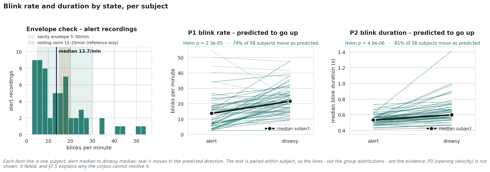
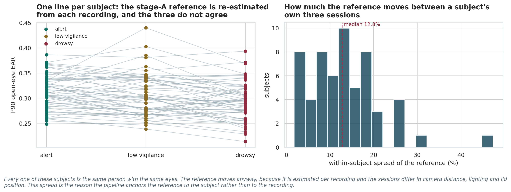
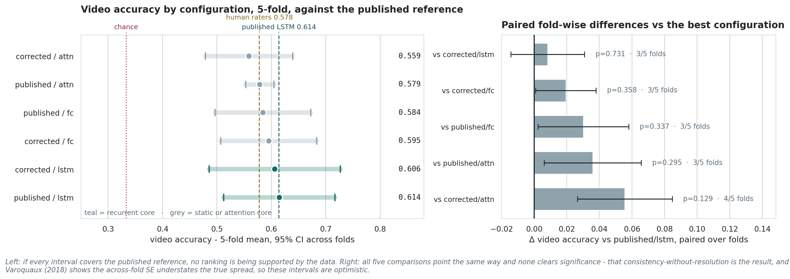
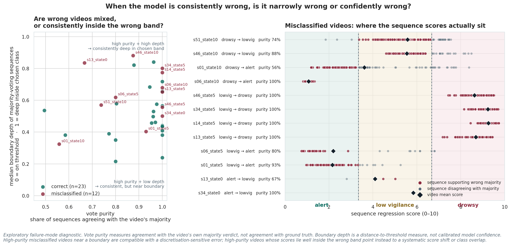

# Driver Fatigue Detection from Facial Video

**A blink-sequence temporal model evaluated under a subject-wise protocol**

MSc Data Science project — Manchester Metropolitan University, 2026  
**Adam Songambele**

## Overview

This project develops and evaluates a camera-based driver-drowsiness detector using **blink behaviour only**. It builds on the blink-sequence approach introduced with the UTA Real-Life Drowsiness Dataset (UTA-RLDD), while using a stricter subject-wise evaluation procedure and additional checks on physiology, normalisation, statistical uncertainty and failure modes.

The main question is not only whether the model can classify drowsiness, but also whether the dataset is precise enough to support small claims about one model configuration being better than another.

The final pipeline processes raw facial video into eye landmarks, detects blink events, converts each blink into a small set of features, and passes sequences of 30 blinks to a temporal model. Sequence scores are then combined into a video-level vigilance verdict.

## Dataset

The project uses **UTA-RLDD**, which contains recordings from 60 participants in three states:

- **Alert**
- **Low vigilance**
- **Drowsy**

The final processing pipeline contains **178 usable videos from all 60 participants**, with 58 participants having usable recordings in all three states.

UTA-RLDD provides one predominant self-reported vigilance state for each complete recording. It does **not** provide temporal labels showing exactly when vigilance changes within a video. This matters when interpreting within-video predictions and misclassifications.

> The original UTA-RLDD videos are not distributed in this repository.

## Pipeline

Each detected blink is represented using four main features:

- blink frequency;
- amplitude;
- duration;
- eyelid velocity.

The model grid crosses two feature definitions with three model cores:

| Feature definition | Model core | Purpose |
|---|---|---|
| Published | Fully connected | Non-temporal benchmark ablation |
| Published | Plain LSTM | Main benchmark-based reference model |
| Published | Attention configuration | Alternative recurrent architecture |
| Corrected | Fully connected | Uses physical time rather than frame-based timing |
| Corrected | Plain LSTM | Tests the timing correction with the reference architecture |
| Corrected | Attention configuration | Tests the timing correction with the alternative recurrent architecture |

The attention configuration changes encoder depth, directionality and readout together, so it is treated as an **alternative recurrent configuration**, not as an isolated test of attention alone.

## Evaluation protocol

Evaluation uses **subject-wise five-fold cross-validation**. Subjects used for testing are never used for training.

Within each outer training fold:

1. validation subjects are held out for model selection;
2. the model is selected without using the outer test subjects;
3. the outer test fold is evaluated only after selection.

This is important for a dataset such as UTA-RLDD because splitting frames or short clips independently can place material from the same person or recording session in both training and test data.

## Main results

| Result | Finding |
|---|---|
| Three-class video accuracy | **0.614** for the published-feature plain LSTM |
| Alert vs not-alert accuracy | **0.846** |
| Physiological validation | Blink rate and blink duration increase with drowsiness, while eyelid-opening velocity decreases |
| Model spread | **0.559–0.614**, a **5.5 percentage-point** range |
| Architecture ranking | Accuracy differences are too small to support a reliable ranking of all six configurations |
| Regression error | The published-feature LSTM has significantly lower regression error than corrected attention, but this does not establish a general ranking |
| Label-shuffle sanity check | Validation accuracy falls to **0.333**, the expected three-class chance level |

### Physiological validation

The blink detector was checked against three pre-specified expectations from the sleep literature:

- blink rate should increase with drowsiness;
- blink duration should increase;
- eyelid-opening velocity should decrease.

All three changes are observed in the expected direction.

## A normalisation issue discovered during feature extraction

A key finding of the project is that the **open-eye reference used before blink features are formed can itself change with vigilance state**.

When each recording is normalised using its own open-eye reference, the drowsy recording has a reference value that is a median **5.2% lower** than the same subject's alert recording. This means that using each recording to define its own scale can remove part of the eye-openness change associated with drowsiness before the temporal model sees the blink features.

The final pipeline instead anchors this reference to the subject's **alert recording**.

This restores the expected decrease in eyelid-opening velocity. The result is a measurement finding; it should not be interpreted as proof that the reference change necessarily improves classification accuracy.

## Model comparison and statistical resolution

The six model configurations produce fairly similar video accuracies. The best observed mean is **0.614** and the lowest is **0.559**, giving a spread of **5.5 percentage points**.

The subject-level analysis indicates that differences of roughly **6–7 percentage points** are around the scale this experiment could reliably distinguish given the observed paired variation. This is a sensitivity estimate rather than a hard threshold.

No accuracy comparison remains significant after correction. The published-feature LSTM does show significantly lower regression error than corrected attention, but that result is specific to that comparison and does not support a complete ranking of the architectures.

## Within-video behaviour and label resolution

The final analysis looks beyond the video-level verdict and asks how sequence predictions behave within individual recordings.

Some misclassified videos contain mixed scores close to a class boundary. Others are much more internally consistent: most or all 30-blink sequences fall well inside a neighbouring vigilance band. This is particularly visible for some videos labelled **low vigilance** that are repeatedly scored in the drowsy range.

These cases cannot automatically be treated as confident model failures. UTA-RLDD assigns one predominant self-reported state to the whole recording, while vigilance can vary during an approximately ten-minute video. Without finer temporal ground truth, the analysis cannot separate:

- model error;
- overlap between neighbouring vigilance states;
- genuine changes in vigilance that are hidden by a single video-level label.

The result therefore supports the use of **finer-grained temporal annotations** in future drowsiness datasets.

## Results artefacts

The `results/` directory contains the numerical outputs and figures used to inspect the detector, model comparisons, ablations and failure modes.

<strong>Cross-validation, model comparison and benchmarks</strong>

- `results/cv_raw_n4.csv`
- `results/cv_subject_level_tests.csv`
- `results/cv_video_predictions.csv`
- `results/benchmark_table_n4.csv`
- `results/baseline_by_core.csv`
- `results/baseline_selection_check.csv`
- `results/l2_scope_ablation.csv`
- `results/fig_cv_forest_and_paired.png`
- `results/fig_baseline_selection_check.png`
- `results/fig_learning_curve_blink_sequences.png`

<strong>Blink detection and physiological checks</strong>

- `results/blink_directional_validation.csv`
- `results/event_threshold_calibration.csv`
- `results/yawn_threshold_sweep.csv`
- `results/fig_blink_detector_validation.png`
- `results/fig_blink_retrieval_examples.png`
- `results/fig_event_threshold_calibration.png`

<strong>Eye-openness reference and normalisation</strong>

- `results/stage_a_ablation_cv_raw.csv`
- `results/stage_a_ablation_folds.csv`
- `results/stage_a_physiology_recheck.csv`
- `results/stage_a_tonic_channel.csv`
- `results/fig_normalisation_stages.png`
- `results/fig_stage_a_reference_ablation.png`
- `results/fig_stage_a_reference_drift.png`

<strong>Frame-rate and feature ablations</strong>

- `results/a2_frame_window_feature_ablation.csv`
- `results/fig_frame_rate_within_vs_between.png`

<strong>Video-level errors and within-video behaviour</strong>

- `results/confusion_binary_video_level.csv`
- `results/confusion_video_level.csv`
- `results/within_video_heterogeneity.csv`
- `results/fig_confusion_and_score_overlap.png`
- `results/fig_misclassification_boundary_diagnostic.png`
- `results/fig_within_video_distributions.png`
- `results/fig_within_video_trajectories.png`
- `results/fig_clip_in_context_s06_alert_55s.png`
- `results/fig_clip_in_context_s13_lowvig_325s.png`
- `results/fig_clip_in_context_s14_drowsy_315s.png`
- `results/fig_clip_in_context_s34_drowsy_230s.png`

<strong>Demonstrator checks</strong>

- `results/demo_paired_comparison.csv`
- `results/demo_sanity_two_condition.csv`
- `results/fig_demo_enrolment_gap.png`

## Important interpretation notes

The headline accuracy should not be read without the evaluation protocol. Similar accuracy values can come from very different tasks depending on whether subjects are separated, whether predictions are made per frame or per video, how many vigilance classes are used, and what facial information is available to the model.

The project therefore avoids treating small numerical differences between configurations as proof that one architecture is better. It also avoids treating a single video-level label as a perfect description of vigilance throughout a complete recording.

The trained demonstrator requires subject-specific enrolment. If the required calibration data or sufficient blink history are unavailable, it withholds a prediction rather than silently substituting a less reliable input.

## Data and privacy

UTA-RLDD contains identifiable facial video. The source recordings are therefore not included in this repository.

Derived participant-linked blink measurements are also handled conservatively because the project found that the blink representation retains some person-specific information. Public repository material should therefore be limited to code, trained models where permitted, aggregate results, figures and non-identifying summaries.

## Limitations

The main limitations are:

- UTA-RLDD contains only 60 participants;
- the labels describe the predominant state of an entire recording rather than shorter time windows;
- the detector requires a sequence of 30 blink events, which introduces an unavoidable delay;
- subject-specific calibration is required;
- the project evaluates one dataset and should not be taken as evidence of demographic fairness or cross-dataset generalisation;
- differences between model configurations are small relative to the statistical resolution of the experiment.

## Future work

The clearest next step is **finer temporal ground truth**. Shorter-window annotations, ideally supported by independent behavioural or physiological measures, would make it possible to test whether the within-video score changes correspond to real changes in vigilance.

Other useful extensions include:

- validation on an independent drowsiness dataset;
- testing lower-latency prediction windows;
- broader demographic and recording-condition evaluation;
- improved calibration strategies;
- explicit uncertainty or refusal mechanisms for unreliable predictions.

## Reference

This project is based on the blink-sequence approach introduced with:

**Ghoddoosian, R., Galib, M. and Athitsos, V. (2019).** *A Realistic Dataset and Baseline Temporal Model for Early Drowsiness Detection.*

Eye-openness measurement follows the Eye Aspect Ratio approach introduced by Soukupová and Čech (2016).

---

This repository accompanies an MSc Data Science dissertation at Manchester Metropolitan University.
